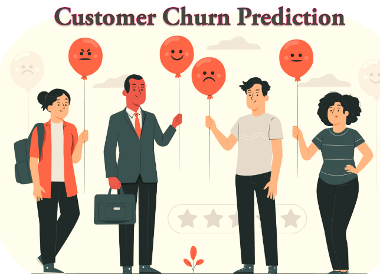

# Forecasting-Customer-Lifetime

## Project Overview

This project aims to predict customer churn using various machine learning models, such as XGBoost, Decision Tree, Random Forest, and k-Nearest Neighbors. The project also involves Extract, Transform, Load (ETL) processes using AWS Glue, implementing a user interface (UI) with React, enabling user authentication and logging with AWS Amplify, and integrating a Tableau dashboard for data exploration.
#### Introduction
The Customer Churn Prediction and Data Exploration Project is a comprehensive endeavour aimed at addressing the challenge of customer churn in the business landscape. Customer churn refers to the phenomenon where customers discontinue their engagement with a product or service. This project leverages advanced machine learning models, data processing pipelines, modern user interface design, and data visualization techniques to tackle this critical issue.

### Project Architecture
The overall architecture of the project involves the utilization of a variety of tools and technologies. Here is a sequential breakdown of the implementation process:
Machine Learning Models, AWS Glue, React UI, AWS Amplify, and Tableau Dashboard.

### Data Collection and Preparation 

After performing ETL using AWS Glue data is stored in AWS Redshift.

### Machine Learning Models
We have chosen appropriate machine learning models (e.g., XGBoost, Decision Tree, Random Forest, k-Nearest Neighbors etc) based on performance and suitability.
Enhanced model effectiveness by conducting feature engineering, identifying essential features, and engineering new ones.
Train the chosen models using historical data and gauge their performance using metrics like accuracy, precision, recall, and F1-score.
If you want to check the implementation follow link: [Machine Learning Models](https://github.com/priyasjsu/Forecasting-Customer-Lifetime-/blob/master/ETL_backend_python_code/biddata-ml.ipynb)

## UI Development
### System Architecture Flow Design

### System Architecture Flow With Technology

#### Tableau Dashboard Integration:
Establish a connection between Tableau and the prepared data source.
Created interactive and visually appealing data visualizations and dashboards, enabling exploration of customer behaviour, trends, and churn predictions.
Seamlessly embed the Tableau dashboard within the React UI, providing a cohesive data exploration experience.
Public Tableau Dashboard link: [Data Exploration Dashboard](https://public.tableau.com/app/profile/priya6730/viz/project-bigdata-228/Dashboard1)

### AWS Amplify Integration:
Secure user access to the React UI by implementing user authentication via AWS Amplify.
Monitor user activities and establish logging mechanisms using AWS Amplify functionalities.

### Continuous Integration and Continuous Deployment (CI/CD) Process
Implemented a robust CI/CD process to ensure efficient and automated deployment of project updates we have utilized GitHub and AWS S3 bucket functionality to implement CI/CD and host the application (but  the application is not up and running this time due to extra cost). This process enhances collaboration among developers, minimizes errors, and accelerates the delivery of new features or improvements. 
#### Here's an overview/flow of the CI/CD deployment process for the project:

### Set up the web application
You can set up the Web Application on your system using the below command, although for Machine learning models you need to download backend_python_code to train the ML models and deploy using AWS or other services.
In the project directory after cloning the repo, you can run:

### `npm start`

Runs the app in the development mode.\
Open [http://localhost:3000](http://localhost:3000) to view it in your browser.

The page will reload when you make changes.\
You may also see any lint errors in the console.

### `npm run build`

Builds the app for production to the `build` folder.\
It correctly bundles React in production mode and optimizes the build for the best performance.

The build is minified and the filenames include the hashes.\
Your app is ready to be deployed!

See the section about [deployment](https://facebook.github.io/create-react-app/docs/deployment) for more information.
In summary, the project's architecture incorporates a diverse array of tools and technologies, with the above steps outlining the methodical progression of its implementation.

##### Note: This project used a wide variety of technologies and integration for learning purposes.
